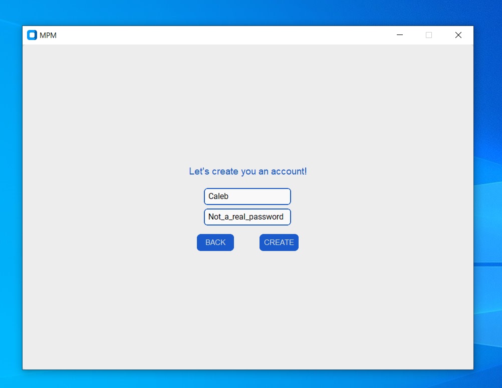
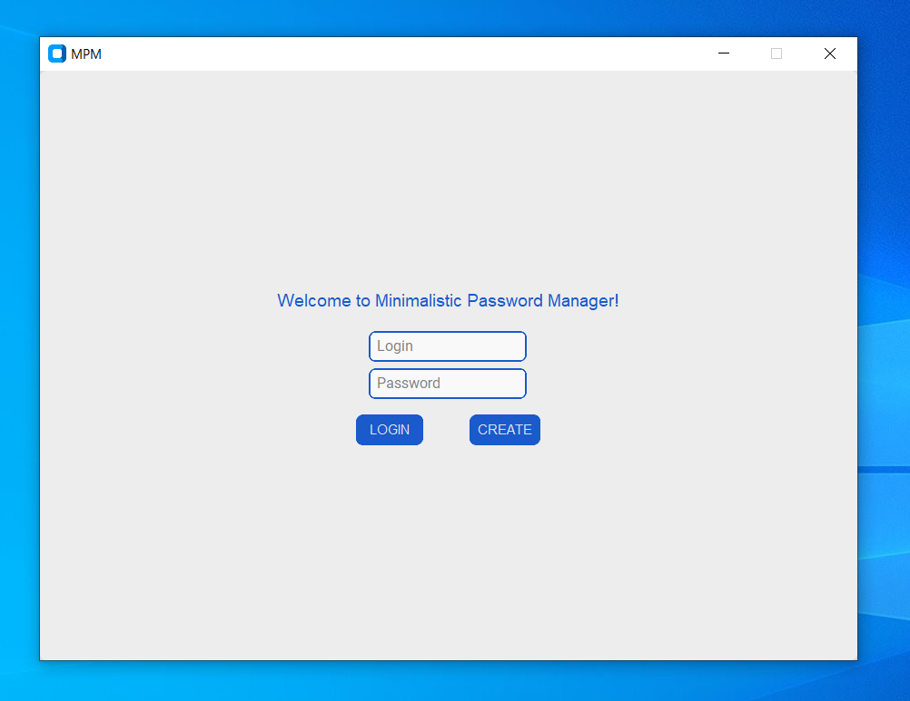
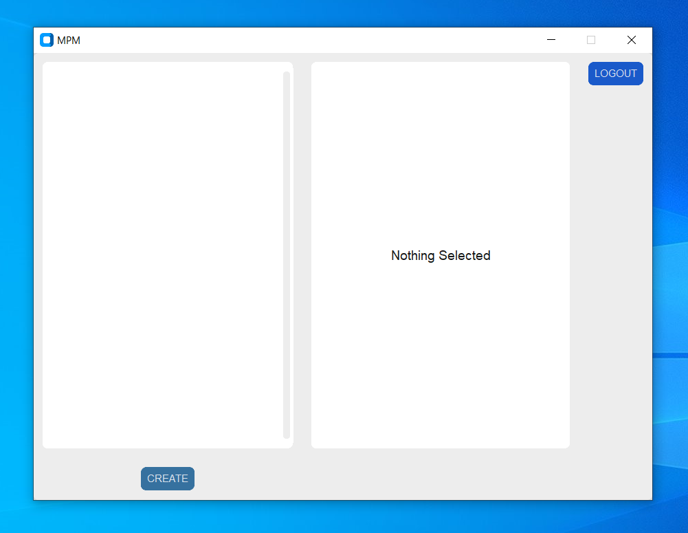
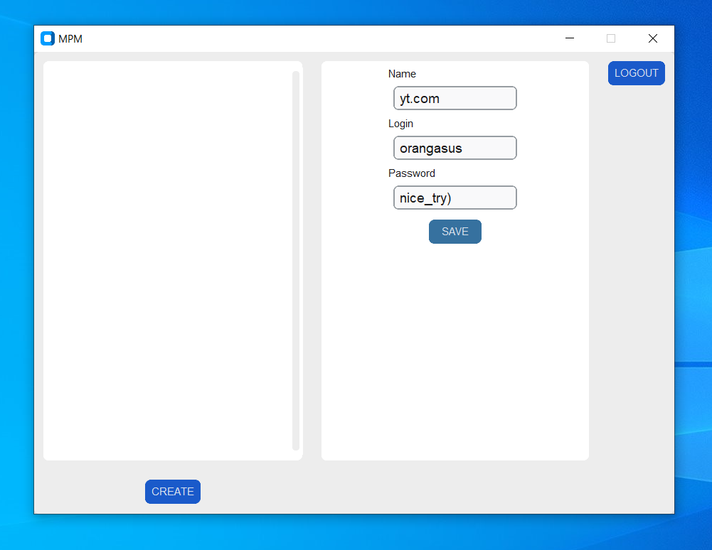
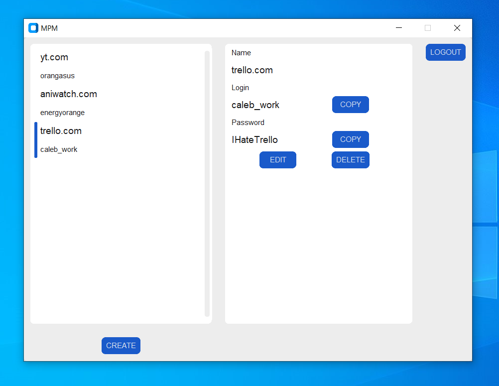

# Minimalistic Password Manager
## Description
Minimalistic Password Manager is a straightforward and secure desktop application designed to simplify password management. With a focus on user-friendliness and security, it helps users store and manage their credentials efficiently
## Features
- **Secure Storage** - Passwords are securely hashed and encrypted for optimal protection
- **User-Friendly UI** - An intuitive UI for easy navigation and management of passwords
- **Supports Multiple Users** - Users can easily log out, create new accounts etc
## Usage
1. Create a User account

2. Log in

3. Now you are able to see your stored items

4. Let's create a couple of items

5. Now all your passwords are neatly organized:)

## Tech Stack
- **SQLite3** for storing data
- **Custom Tkinter** for GUI (never again)
- **Fernet** for encrypting user's saved items
- **Bcrypt** for hashing user password
## Potential Improvements
- **Search Bar**\
Implementing search by name and login so users can find items more easily